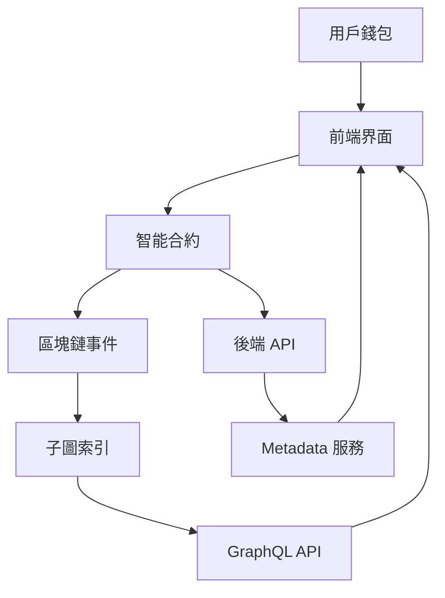

# 11. 技術架構總覽 (Technical Architecture Overview)

> **V1.0 技術架構** · 2025 年 10 月校準版（對應產品 v1.5.0.0）

## 11.1 專案架構模式 (Project Architecture Pattern)

**Soulbound Saga** 採用微服務架構模式，將不同功能模組分別部署和管理，實現高度的可擴展性和維護性。

### 🏗️ 核心組件架構

```
🎮 DungeonDelvers 生態系統
├── 🌐 前端應用 (SoulboundSaga)
├── 🔗 智能合約層 (DungeonDelversContracts)
├── 📊 數據索引層 (dungeon-delvers-subgraph)
├── 🚀 後端 API (dungeon-delvers-metadata-server)
└── 📚 文檔系統 (dungeon-delvers-whitepaper)
```

## 11.2 各子專案詳細說明

### 🌐 前端應用 - SoulboundSaga
**技術棧**: React 18 + TypeScript + Vite + wagmi v2  
**專案位置**: `/Users/sotadic/Documents/GitHub/SoulboundSaga`  
**部署**: Vercel  

**核心功能**:
- Web3 錢包連接與交互
- NFT 展示和交易界面  
- 遊戲機制操作 (鑄造、探索、升級)
- 實時數據展示和統計分析
- 響應式設計和手機端優化

**技術亮點**:
```typescript
// wagmi v2 + WalletConnect v2 多錢包佈局
const config = createConfig({
  chains: [bsc],
  connectors: [
    metaMask({ shimDisconnect: true }),
    walletConnect({
      projectId: import.meta.env.VITE_WALLETCONNECT_PROJECT_ID,
      disableProviderPing: true,
      mobileLinks: ['metamask', 'trust', 'okx'],
    }),
    injected({ shimDisconnect: true }),
  ],
});

const { connectAsync, connectors } = useConnect();
await connectAsync({ connector: connectors.find(c => c.id === 'walletConnect')! });
```

### 🔗 智能合約層 - DungeonDelversContracts  
**技術棧**: Solidity + Foundry + OpenZeppelin
**專案位置**: `/Users/sotadic/Documents/DungeonDelversContracts`
**網路**: BASE Mainnet (Chain ID: 8453)  

**核心合約**:
```solidity
// NFT 與遊戲模組
Hero.sol             // 英雄 NFT
Relic.sol            // 聖物 NFT
Party.sol            // 隊伍 NFT
PlayerProfile.sol    // 玩家 SBT

// 核心流程
DungeonCore.sol      // 中央協調與權限管理
PlayerVault.sol      // 資金流與推薦
DungeonMaster.sol    // 地城／遠征機制
AltarOfAscension.sol // 升星與素材消耗
VipStaking.sol       // VIP 質押
VRFManager.sol       // Chainlink VRF v2.5
```

**安全特性**:
- Chainlink VRF V2.5 保證隨機公平性
- 多重簽名和時間鎖機制
- ReentrancyGuard 防重入攻擊
- Ownable 權限控制系統

### 📊 數據索引層 - dungeon-delvers-subgraph
**技術棧**: The Graph Protocol + GraphQL  
**專案位置**: `/Users/sotadic/Documents/GitHub/dungeon-delvers-subgraph`  
**版本**: v1.5.0.0  

**索引核心資料結構**:
```graphql
type Player {
  id: ID!
  heroCount: Int!
  relicCount: Int!
  partyCount: Int!
  referralRelation: ReferralRelation @derivedFrom(field: "user")
  referredUsers: [ReferralRelation!] @derivedFrom(field: "referrer")
}

type Hero {
  id: ID!
  tokenId: BigInt!
  contractAddress: Bytes!
  owner: Player
  rarity: Int
  power: BigInt
  status: String!
  isBurned: Boolean!
  createdAt: BigInt!
  burnedAt: BigInt
}
```

**查詢能力**:
- 實時 NFT / VIP / Vault 事件同步
- 玩家資產、推薦、抽稅明細
- 遊戲事件歷史追蹤
- 排行榜與健康檢查儀表板

### 🚀 後端 API - dungeon-delvers-metadata-server
**技術棧**: Node.js + Express.js + ethers.js  
**專案位置**: `/Users/sotadic/Documents/dungeon-delvers-metadata-server`  
**版本**: v1.5.0.0  
**部署**: Render  

**API 端點設計**:
```http
GET /metadata/:type/:id        # VRF 未完成時回傳 202 + Retry-After
POST /metadata/refresh/:id     # 手動清除緩存並重新抓取
GET  /health                   # 子圖端點、快取、Redis 狀態
GET  /admin/cache-stats        # 緩存命中率與 TTL 觀察
```

**核心特性**:
- 動態 NFT metadata 生成（純子圖資料來源，零 RPC 成本）
- SVG / JSON 模板化輸出，支援行動裝置與市集快取
- 多層緩存策略 (記憶體 + CDN) 與事件觸發式刷新
- 未揭示狀態統一回傳 `202 Accepted`，避免市集長期快取 404
- Goldsky / The Graph 優先級切換與健康快照 (`/health` 回傳 `subgraphEndpoints`)
- Helmet、速率限制與 Redis backoff 保護

### 📚 文檔系統 - dungeon-delvers-whitepaper  
**技術棧**: GitBook + Markdown  
**專案位置**: `/Users/sotadic/Documents/GitHub/dungeon-delvers-whitepaper`  
**版本**: V1.0 第一代遊戲  

**文檔結構**:
- 專案概述和遊戲機制
- 技術架構和智能合約
- 代幣經濟學和 NFT 系統
- 開發指南和 API 文檔

## 11.3 數據流架構 (Data Flow Architecture)

### 🔄 用戶操作流程


### 📡 配置同步系統
```bash
# 統一配置管理流程
DungeonDelversContracts/config/deployed-addresses.mainnet.json
├─ scripts/essential/extract-abis.js → SoulboundSaga/src/contracts/abi
│                                     ↳ dungeon-delvers-metadata-server/abis
├─ dungeon-delvers-subgraph/scripts/sync-subgraph-manifest.cjs → subgraph.yaml
└─ metadata-server/config/contracts.json  # 統一配置載入器依此覆寫
```

## 11.4 部署和 CI/CD 策略

### 🚀 部署環境
- **前端**: Vercel (自動部署)
- **後端**: Render (容器化部署)
- **子圖**: Goldsky + The Graph Network (去中心化索引)
- **智能合約**: BASE Mainnet (永久部署)

### 🔄 持續集成流程
```yaml
# GitHub Actions Workflow
- Code Push → Automated Tests
- Tests Pass → Build & Deploy  
- Deploy Success → Configuration Sync
- Sync Complete → Health Checks
```

## 11.5 安全和監控系統

### 🛡️ 安全措施
- **智能合約**: 多重簽名 + 時間鎖
- **API 服務**: CORS + 速率限制 + Helmet 安全頭
- **數據傳輸**: HTTPS + 嚴格 CSP
- **錢包集成**: 官方 MetaMask Connector + WalletConnect v2 + Injected fallback

### 📊 監控和告警
```javascript
// 健康檢查端點（例）
{
  "frontend": "https://www.dungeondelvers.xyz/health",
  "backend": "https://dungeon-delvers-metadata-server.onrender.com/health",
  "subgraph": "https://api.goldsky.com/status/dungeon-delvers",
  "contracts": "BscScan 自動化監控 + Discord Webhook"
}
```

## 11.6 性能優化策略

### ⚡ 前端優化
- **代碼分割**: React.lazy + Suspense
- **圖像優化**: WebP + 懶加載
- **緩存策略**: Service Worker + CDN
- **Bundle 分析**: Rollup Visualizer

### 🔧 後端優化  
- **API 緩存**: 5分鐘內存緩存
- **數據壓縮**: gzip 壓縮傳輸
- **連接池**: 數據庫連接復用
- **負載均衡**: 多實例部署

### 📈 區塊鏈優化
- **Gas 優化**: 批量操作 + 狀態壓縮
- **事件索引**: 高效的 GraphQL 查詢
- **VRF 優化**: Direct Funding 模式
- **交易排隊**: 智能 Gas 價格策略

## 11.7 擴展性設計

### 🌟 水平擴展能力
- **微服務架構**: 各組件獨立擴展
- **API 網關**: 統一入口和負載分散
- **數據庫分片**: 用戶數據水平分割
- **CDN 分發**: 全球內容分發網路

### 🔮 未來技術升級
- **Layer 2 集成**: Polygon, Arbitrum 支援
- **跨鏈橋接**: 多鏈資產互操作性
- **AI 增強**: 智能遊戲平衡和推薦
- **VR/AR 集成**: 沉浸式遊戲體驗

---

> **💡 開發者注意**: 此架構文檔將依 v1.x 發布節奏滾動調整，所有決策均以使用者體驗與系統穩定性為優先。

**最後更新**: 2025 年 10 月 12 日  
**架構版本**: V1.5.0.0（Soulbound Saga 第一代）  
**維護團隊**: DungeonDelvers 開發團隊
