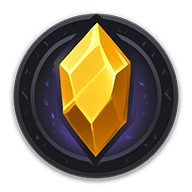

# 🏰 Soulbound Saga: 靈魂契約傳奇 白皮書

> **Fully On-Chain Roguelike on BNB Chain**  
> **Delve Dungeons & Earn $SOUL**  
> **Built by CN builders for the world**

<figure><figcaption>
踏入靈魂契約的數位傳奇
</figcaption></figure>

_最後更新時間: 2025年9月 - V1.0 第一代遊戲_

> **⚡ 全新品牌**：Soulbound Saga 代表著我們對 Web3 遊戲未來的重新定義。完全上鏈、真正去中心化、由中國建造師為全世界打造的 Roguelike 傳奇。

#### 🌟 歡迎踏入靈魂契約的史詩世界

在數位與現實交匯的邊界，存在一個名為「**靈魂紀元**」的神秘維度。這裡，每個存在都與區塊鏈的永恆記憶綁定，形成了不可磨滅的「**靈魂契約**」。

**Soulbound Saga: I. Delvers of Soul** 是完全運行於 BNB Chain 上的史詩級 Roguelike 遊戲。當古老的魔法與現代的程式碼融合，誕生了一個每個決策都被永恆記錄、每個成就都無法被奪走的傳奇世界。

您不只是玩家，您是這個去中心化宇宙的共同創造者。您的英雄、您的故事、您的傳奇，都將成為區塊鏈歷史的一部分。

## 🎯 革命性特色

### 🏰 史詩級的靈魂契約世界
在數位與現實交匯的「靈魂紀元」中，每個存在都與區塊鏈的永恆記憶綁定，形成不可磨滅的「靈魂契約」。您不只是玩家，您是這個去中心化宇宙的共同創造者。

### ⚡ 完全上鏈的 Roguelike 體驗
所有遊戲邏輯都在 BNB Chain 上執行，實現可證明的公平性。每次冒險都是獨一無二的，由演算法生成的程序地城確保無限的探索可能性。

### 💎 靈魂探索者與魂器系統
您的英雄是「靈魂探索者」，裝備著能與區塊鏈共振的「魂器」。所有 NFT 完全屬於您，記錄在永恆區塊中，無人能奪走。

### 🏆 $SOUL 數位精華經濟
通過探索程序地城獲得 $SOUL 代幣獎勵。每個 $SOUL 都承載著冒險者的傳奇故事，建立真正可持續的靈魂契約經濟。

## 🚀 為什麼選擇 Soulbound Saga？

Soulbound Saga 不只是遊戲，它是一個完整的數位生態系統，為 Web3 玩家提供前所未有的體驗：

### 🔗 靈魂契約的永恆記憶
基於永恆區塊的去中心化架構，沒有中央伺服器，每個決策都被永恆記錄，無人能篡改您的傳奇

### 🎮 史詩級的冒險體驗
精心設計的靈魂契約機制，每次探索都是在區塊鏈上譜寫的獨特傳奇，充滿智慧與策略的挑戰

### 💰 靈魂精華的價值創造
基於 $SOUL 的靈魂契約經濟，每次冒險都在創造真實價值，確保數位資產的長期保值與增值

## 📚 探索靈魂契約的奧秘

準備好踏入這個史詩級的數位宇宙？請查看我們完整的靈魂契約典籍：

- **[史詩傳奇的開端](01-project-overview.md)** - 靈魂紀元的誕生與願景
- **[完全上鏈的 Roguelike 機制](02-core-gameplay.md)** - 探索程序地城的奧秘
- **[$SOUL 靈魂精華經濟](03-tokenomics.md)** - 數位精華的價值循環
- **[完全上鏈的技術革命](05-technology-enhanced.md)** - 永恆區塊的技術奇蹟
- **[靈魂契約發展路線圖](06-roadmap.md)** - 傳奇的未來篇章

## 🎯 開啟您的靈魂契約

準備好成為靈魂探索者了嗎？

👉 **[開啟靈魂探索者指南](09-quickstart-guide.md)**

## 🤝 加入靈魂契約同盟

[🎮 進入 Soulbound Saga](https://www.dungeondelvers.xyz)  
[📱 Telegram 靈魂同盟](https://t.me/Soulbound_Saga)  
[🐦 Twitter 傳奇頻道](https://x.com/Soulbound_Saga)

**一起譜寫 Soulbound Saga 的史詩傳奇！**

<figure><figcaption></figcaption></figure>

---

**Soulbound Saga: 靈魂契約傳奇** - 在區塊鏈上永恆記錄的史詩冒險

> *"在靈魂紀元，每個決策都是永恆，每個成就都是傳奇。您準備好在區塊鏈的永恆記憶中寫下您的史詩了嗎？"*
